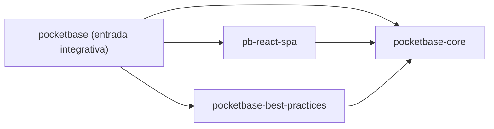

# INDEX — PocketBase Skill Cluster (Registry & Orchestration)

> **Você é um agente e acabou de "entrar" neste diretório? Comece aqui.**
> O mapa canônico é [`index.json`](index.json) (machine-readable).
> Este arquivo é a versão human/LLM-readable do mesmo mapa — divergência
> entre os dois é bug (o gate `Gate - Registry` do CI pega).

## Entrada integrativa

A skill `pocketbase` — o **`SKILL.md`** na raiz deste cluster — é a
porta única que **norteia e despacha** para as sub-skills. É ela que os
harnesses (omp, pi) expõem; as sub-skills ficam um nível abaixo. Ela não
duplica conteúdo: roteia por intenção e carrega este INDEX como mapa.

## Compatibilidade (fonte da verdade: `index.json` → `compatibility`)

| Componente | Versão validada | Política |
|---|---|---|
| PocketBase core | **0.40.4** (latest: 2026-09-12) | CI (`Gate - Compat`) compara com a release latest upstream; minor divergente ⇒ gate vermelho |
| JS SDK | **0.28.1** (latest: 2026-09-05) | idem |
| Mínimos por skill | ver `metadata.json` de cada skill (`compatibility`) | descritivo |

## Skills disponíveis

| Skill | Versão | Faz o quê | Depende de |
|---|---|---|---|
| [`pocketbase-core`](pocketbase-core/SKILL.md) | 1.1.0 | Setup/servidor + scripts REST: superuser, collections, records, backups, health, migrações, e2e | — |
| [`pb-react-spa`](pb-react-spa/SKILL.md) | 1.0.0 | SPA React (Vite + TanStack Router/Query + shadcn + Biome), hooks, auth provider, typegen, deploy | `pocketbase-core` |
| [`pocketbase-best-practices`](pocketbase-best-practices/SKILL.md) | 1.4.0 | 64 regras priorizadas: schema, API rules, auth, queries, realtime, arquivos, deploy, Go/JSVM | `pocketbase-core` |

## Grafo de dependência



Acíclico por construção — `Gate - Registry` valida (Kahn) a cada push.

## Context Loader (contrato hierárquico do system prompt)

1. **Nível 1 (raiz)** — "Você está no cluster de skills PocketBase. Leia `INDEX.md`/`index.json` para entender a arquitetura."
2. **Nível 2 (descoberta)** — "Antes de iniciar a tarefa, identifique qual sub-skill em `metadata.json` possui as `capabilities` necessárias."
3. **Nível 3 (execução)** — "Siga estritamente o `SKILL.md` e as `rules/`/`references/` da sub-skill escolhida, mais `GLOBAL_RULES.md`."

## Workflow integrado do agente

1. **Analysis** — leia `index.json`; identifique capabilities exigidas pela tarefa.
2. **Route** — ex.: "criar coleção" → sub-skill `pocketbase-core`; "gerar hook React" → `pb-react-spa`; "isso é seguro/escalável?" → `pocketbase-best-practices`. Tarefa composta = sequência, mantendo nomes de coleções consistentes entre passos.
3. **Cross-Reference** — sub-skills podem ler `references/` umas das outras **via symlinks declarados** (abaixo). Nunca copie conteúdo entre elas — linke.
4. **Execute** — respeite `GLOBAL_RULES.md` + `.shared/common_rules.md`.
5. **Projeto novo do zero** — `bash scripts/bootstrap-project.sh <dir> [--frontend]`.

## Symlinks declarados (fonte única, zero duplicação)

| Link | Aponta para | Por quê |
|---|---|---|
| `pb-react-spa/references/pocketbase-api.md` | `pocketbase-core/references/api-rules-guide.md` | Contrato de API rules compartilhado |
| `pb-react-spa/references/best-practices.md` | `pocketbase-best-practices/SKILL.md` | Índice de regras aplicáveis ao frontend |

Integridade verificada por `Gate - Registry`: symlink no disco deve estar declarado no `index.json` e resolver dentro do repo.

## Anatomia padronizada do cluster

```
.                        # raiz = skill `pocketbase` (entrada integrativa)
├── SKILL.md             # roteador: intenção → sub-skill
├── INDEX.md             # este mapa
├── index.json           # manifesto canônico (machine)
├── GLOBAL_RULES.md      # regras que valem para todas
├── .shared/             # common_rules.md + logger.sh
├── scripts/             # orquestrador + validators (CI e local)
├── pocketbase-core/     # sub-skill: operação de backend
│   ├── metadata.json
│   ├── SKILL.md
│   ├── scripts/ · references/ · assets/
├── pb-react-spa/        # sub-skill: SPA React
│   ├── metadata.json
│   ├── SKILL.md
│   └── references/      # inclui os symlinks cross-skill
└── pocketbase-best-practices/  # sub-skill: 64 regras
    ├── metadata.json
    ├── SKILL.md
    └── rules/ · references/
```

## Orquestração e gates (CI/CD GitOps)

- Loop: spec → branch `{feat|fix|refactor|chore|docs}/slug` → push → CI gateia → PR quando M==N → auto-merge → main protegido → tag `v*` → release.
- Checks required: `Sintaxe (JSON/YAML/Shell/Python)` · `Gate - Registry` · `Gate - Compat`.
- Validadores rodam localmente também: `python3 scripts/validate-registry.py` · `bash scripts/validate-compat.sh` · `bash scripts/bootstrap-project.sh --check`.

## Instalação em harnesses (omp, pi)

Ambos leem `~/.agents/skills/` (o pi também aceita `"skills": [caminho]` no
settings). Instalação recomendada — um symlink da raiz do cluster:

```bash
ln -sfn ~/SKILLS/pocketbase ~/.agents/skills/pocketbase
```

Ompi expõe a entrada integrativa `pocketbase`; o pi (descoberta recursiva)
expõe a entrada **e** as sub-skills individuais (`/skill:pocketbase-core` etc.).

## Como adicionar uma sub-skill nova

1. Crie `<slug>/` com a anatomia acima (`metadata.json` + `SKILL.md`).
2. Registre em `index.json` (skills + dependências + capabilities).
3. Se a entrada integrativa deve rotear para ela, adicione a linha no `SKILL.md` da raiz.
4. Rode `python3 scripts/validate-registry.py` — verde? commit no branch, o CI re-gateia.
5. Atualize este INDEX.md (tabela + grafo, se o grafo mudar).
